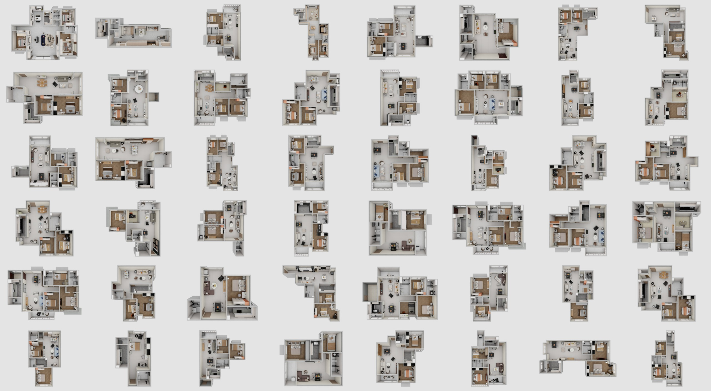

<div align="center">

# WorldSimReady-Home

[](https://huggingface.co/datasets/Yootta/WorldSimReady-Home)
[](https://modelscope.cn/datasets/Yootta/WorldSimReady-Home)

</div>



## Overview

WorldSimReady-Home is built from manually created object assets with consistent physical properties. These assets are assembled into household scenes, each of which undergoes manual review to ensure that its physical properties are correctly configured. Building on these scenes, we developed a scalable simulation task data generation framework that supports batch generation across different robot embodiments and tasks.

## Explore the dataset

Download the dataset from **[Hugging Face](https://huggingface.co/datasets/Yootta/WorldSimReady-Home)**.

## Citation

If you use WorldSimReady-Home in your research, please cite the dataset and record the dataset revision used in your experiments.

```bibtex
@misc{world_simready_home,
  author       = {{Yootta}},
  title        = {{WorldSimReady-Home}},
  year         = {2026},
  howpublished = {\url{https://huggingface.co/datasets/Yootta/WorldSimReady-Home}}
}
```

## License

The dataset is licensed under the [Creative Commons Attribution-NonCommercial-ShareAlike 4.0 International (CC BY-NC-SA 4.0)](https://creativecommons.org/licenses/by-nc-sa/4.0/) license.

